
如何通过Github Pages + hexo搭建个人博客

<!--more-->

## 搭建环境

### 安装Node.js
可以直接去[官网](https://nodejs.org/en/download/)下载安装，安装成功截图如下：

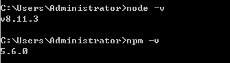

### 安装git
可以直接去[官网](https://git-scm.com/downloads)下载安装，安装成功截图如下：

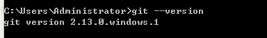

### 安装hexo
在自己认为合适的地方新建一个文件夹，我是在 **E:/Notes/** 建了一个blog文件夹，然后通过命令行进入该文件夹内：

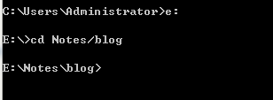

接着输入 **npm install hexo -g** 安装hexo，安装成功截图如下：

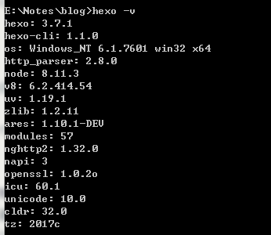

最后输入 **hexo init** 初始化文件夹，初始化好后输入 **npm install** 安装所需要的组件，文件夹如下：

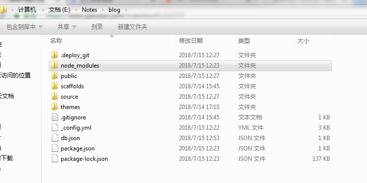

现在你就可以体验一下hexo啦，输入 **hexo g && hexo s** 启动服务器，默认端口为4000，所以打开浏览器，输入 **http://localhost:4000** ，hexo界面就出现啦：

## 配置Github

### 配置Github Pages

[Github](https://github.com/)账户注册和新建项目，项目必须要遵守格式：账户名.github.io，不然接下来会有很多麻烦。并且需要勾选Initialize this repository with a README：

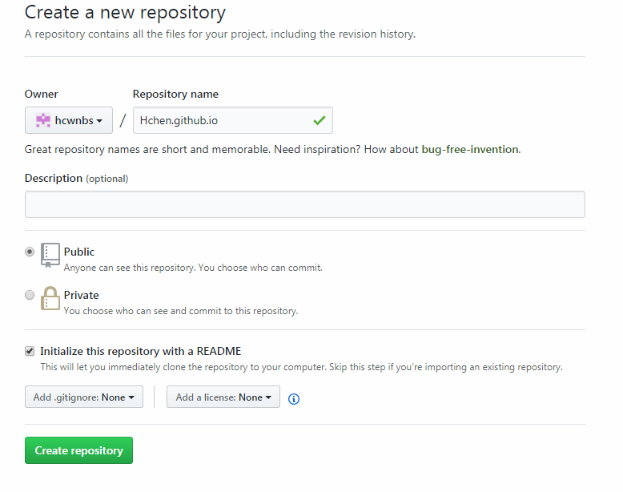

在建好的项目右侧有个settings按钮，点击它，向下拉到GitHub Pages，你会看到那边有个网址，访问它，你将会惊奇的发现该项目已经被部署到网络上，能够通过外网来访问它:

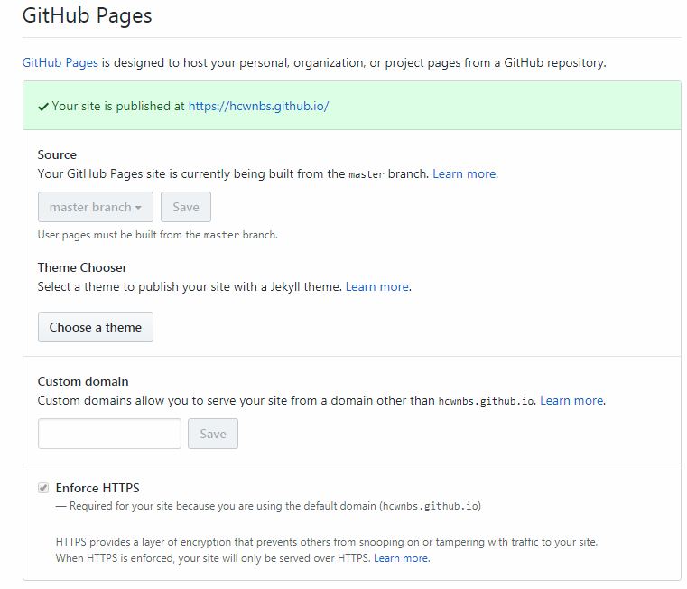

### 将Hexo与Github page联系起来

首先要先配置github的ssh key（如果是第一次使用git），详情请见[官方教程](https://help.github.com/articles/generating-a-new-ssh-key-and-adding-it-to-the-ssh-agent/)。

任意目录右键点击gitbash here，输入 **ssh -T git@github.com** 测试添加ssh是否成功。如果看到Hi后面是你的用户名，就说明成功了，成功截图如下：

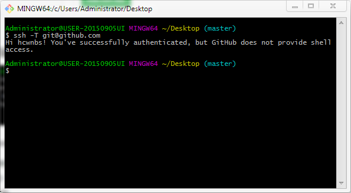

然后配置hexo，打开 **blog/_config.yml** ，在末尾找到 **deploy:** ，配置如下：

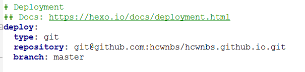

将其中的hcwnbs换成你自己创建的项目名就行了。

## 上传你的第一篇博客
到此为止，所有的基本配置已经全部完成，接下来就可以写你的第一篇博客并上传啦！

### 新建一篇博客
在cmd执行命令： **hexo new post “博客名”** 

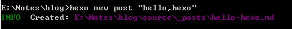

 这时候在文件夹_posts目录下将会看到已经创建的文件：
 
 
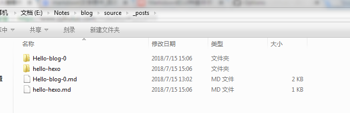

 
 在生成以及部署文章之前，需要安装一个扩展：**npm install hexo-deployer-git --save**
 
 使用编辑器编辑创建的 **hello-hexo.md** 文件，使用的是 **markdown** 语法这里推荐一个网页版的 **markdown** 编辑器，可以边预览边编辑，还有教程：[Cmd Markdown编辑阅读器](https://www.zybuluo.com/mdeditor)：
 
 
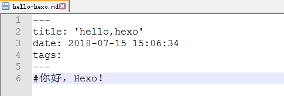

 
 接下来只要输入 **hexo clean && hexo g && hexo d** 就可以生成以及部署博客啦。部署成功后访问你的地址：  **http://用户名.github.io** 。那么将看到生成的文章：
 

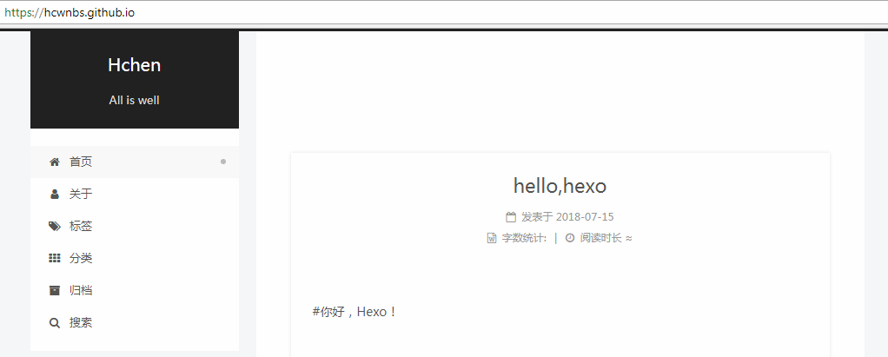

好啦，到此为止，一个个人博客就搭好啦，接下来如果想要好好布置你的博客，并实现各种个性化设置，请看[博客布置篇](https://hcwnbs.github.io/2018/07/16/hexo-next/)。
