<font size="5"><center>如何个性化打造博客</center></font>

<!--more-->

## Hexo主题--next

### 下载安装**next**

在你的博客站点根目录，打开命令行输入：

```
git clone https://github.com/iissnan/hexo-theme-next themes/next
```

然后在 **themes** 文件夹里面就能看到下好的包含 **next** 主题的文件夹：

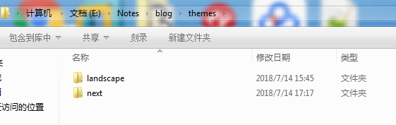

最后打开根目录下的 **_config.yml** 文件，找到 **theme** ，修改截图如下：

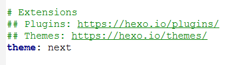

这样子 **next** 主题就下载安装好了，在根目录命令行输入：

```
hexo clean && hexo g && hexo s
```

然后打开 [localhost:4000](http://localhost:4000) 看下你的新博客界面吧：

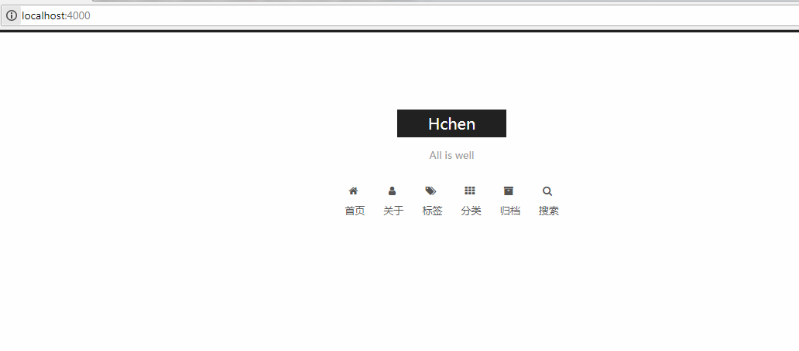

### 设置 **next** 的 **scheme**

**next** 主题也有好几种风格，通过修改主题目录的 **_config.yml** 文件来改变风格，修改如下：

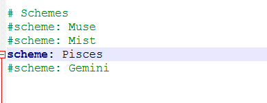

博客风格也就变成了：

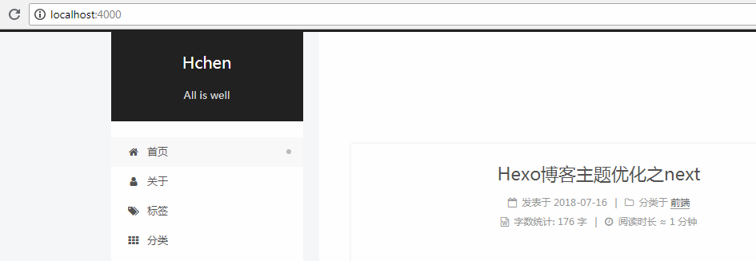

### 设置菜单

我们目前博客菜单才仅仅只有首页、归档两项，**next** 主题还内置了一些菜单栏可供挑选设置，打开主题目录的 **_config.yml** 文件，然后找到 **menu** ：

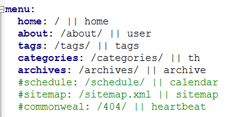

要设置的就把 **#** 去掉就行了。

这时候如果打开那几项菜单选项还是会出现 **404** 页面的，你还需要把这几个页面新建出来，通过在根目录命令行输入以下命令：

```
hexo new page "你要新建的菜单名字"
```

然后就可以在根目录下的 **source** 文件夹中找到了：

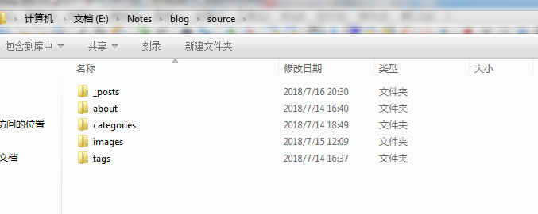

在博客里的菜单选项也可以打开啦。

### 设置侧栏，头像，网页logo

1.侧栏的设置：
打开主题目录的 **_config.yml** 文件，找到 **sidebar:** 可以把 **position** 设置为 **right** 或 **left**
设置成功截图如下：

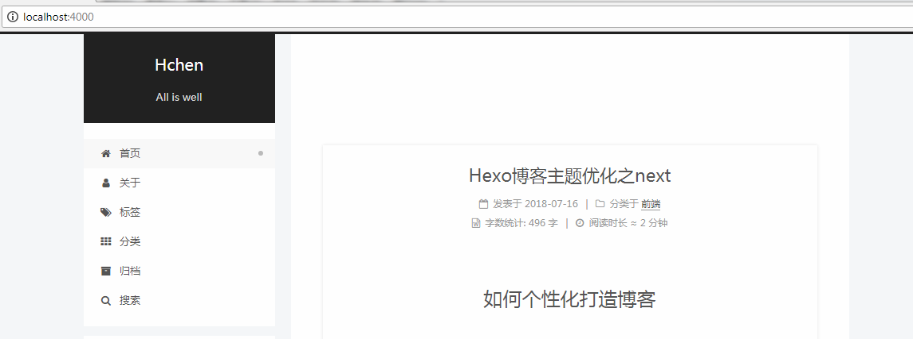

2.头像的设置：
打开主题目录的 **_config.yml** 文件，找到 **avatar** 后面加你头像的路径（最好把头像放到它原先设置的地方）
设置成功截图如下：

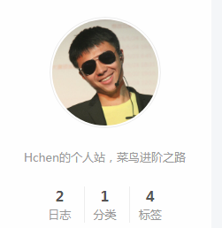

3.网页logo的设置：
打开主题目录的 **_config.yml** 文件，找到 **favicon** 把下面 **medium** 后面改成你的网页logo的文件。
设置成功截图如下：

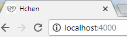

### 修改文章底部的那个带#号的标签

修改模板 **/themes/next/layout/_macro/post.swig**，搜索 **rel="tag">#** ，将 **#** 换成 **<i class="fa fa-tag"></i>**
设置成功截图如下：

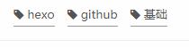

### 主页文章添加阴影效果

打开 **\themes\next\source\css\_custom\custom.styl** 文件,向里面加入：

```
// 主页文章添加阴影效果
 .post {
   margin-top: 60px;
   margin-bottom: 60px;
   padding: 25px;
   -webkit-box-shadow: 0 0 5px rgba(202, 203, 203, .5);
   -moz-box-shadow: 0 0 5px rgba(202, 203, 204, .5);
  }
```
设置成功截图如下：

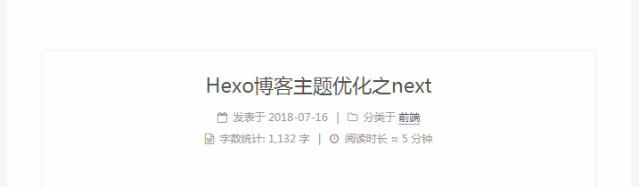

## 个性化设置

### 点击桃心

首先在 **/themes/next/source/js/src** 文件夹下新建一个 **clicklove.js** 文件，把下面这段代码复制进去：

```
!function(e,t,a){function n(){c(".heart{width: 10px;height: 10px;position: fixed;background: #f00;transform: rotate(45deg);-webkit-transform: rotate(45deg);-moz-transform: rotate(45deg);}.heart:after,.heart:before{content: '';width: inherit;height: inherit;background: inherit;border-radius: 50%;-webkit-border-radius: 50%;-moz-border-radius: 50%;position: fixed;}.heart:after{top: -5px;}.heart:before{left: -5px;}"),o(),r()}function r(){for(var e=0;e<d.length;e++)d[e].alpha<=0?(t.body.removeChild(d[e].el),d.splice(e,1)):(d[e].y--,d[e].scale+=.004,d[e].alpha-=.013,d[e].el.style.cssText="left:"+d[e].x+"px;top:"+d[e].y+"px;opacity:"+d[e].alpha+";transform:scale("+d[e].scale+","+d[e].scale+") rotate(45deg);background:"+d[e].color+";z-index:99999");requestAnimationFrame(r)}function o(){var t="function"==typeof e.onclick&&e.onclick;e.onclick=function(e){t&&t(),i(e)}}function i(e){var a=t.createElement("div");a.className="heart",d.push({el:a,x:e.clientX-5,y:e.clientY-5,scale:1,alpha:1,color:s()}),t.body.appendChild(a)}function c(e){var a=t.createElement("style");a.type="text/css";try{a.appendChild(t.createTextNode(e))}catch(t){a.styleSheet.cssText=e}t.getElementsByTagName("head")[0].appendChild(a)}function s(){return"rgb("+~~(255*Math.random())+","+~~(255*Math.random())+","+~~(255*Math.random())+")"}var d=[];e.requestAnimationFrame=function(){return e.requestAnimationFrame||e.webkitRequestAnimationFrame||e.mozRequestAnimationFrame||e.oRequestAnimationFrame||e.msRequestAnimationFrame||function(e){setTimeout(e,1e3/60)}}(),n()}(window,document);
```
然后修改 **\themes\next\layout\_layout.swig** 文件，在末尾添加这段代码：

```
<!-- 页面点击小红心 -->
<script type="text/javascript" src="/js/src/clicklove.js"></script>
```

这样子点击就会有小爱心出现啦。

设置成功截图如下：

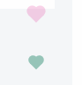

### 头像旋转

找到 **/themes/next/source/css/_common/components/sidebar/sidebar-author.styl** 文件，修改为以下代码：

```
.site-author-image {
  display: block;
  margin: 0 auto;
  padding: $site-author-image-padding;
  max-width: $site-author-image-width;
  height: $site-author-image-height;
  border: $site-author-image-border-width solid $site-author-image-border-color;
  border-radius: 60%;
  transition: 2.5s all;  
}

.site-author-image:hover {
    transform: rotate(360deg);
}


.site-author-name {
  margin: $site-author-name-margin;
  text-align: $site-author-name-align;
  color: $site-author-name-color;
  font-weight: $site-author-name-weight;
}

.site-description {
  margin-top: $site-description-margin-top;
  text-align: $site-description-align;
  font-size: $site-description-font-size;
  color: $site-description-color;
}
```

这样子头像就变成圆形而且能够旋转了。